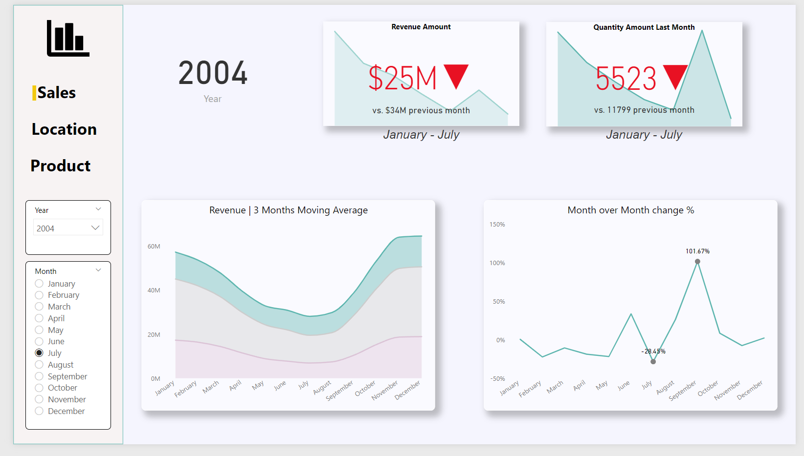
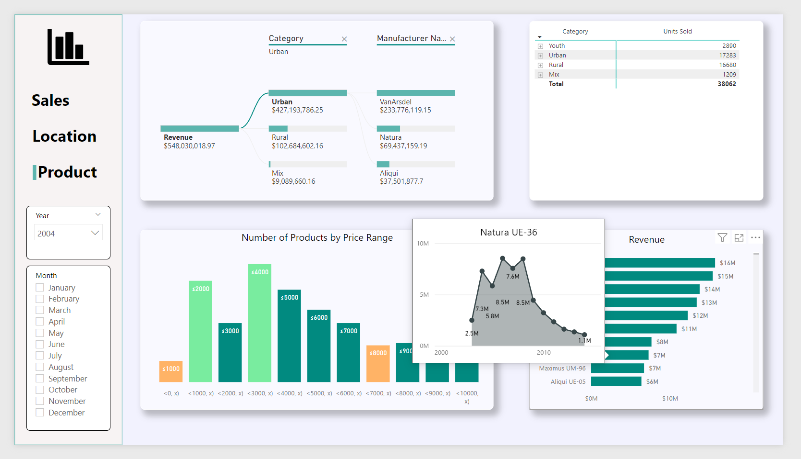
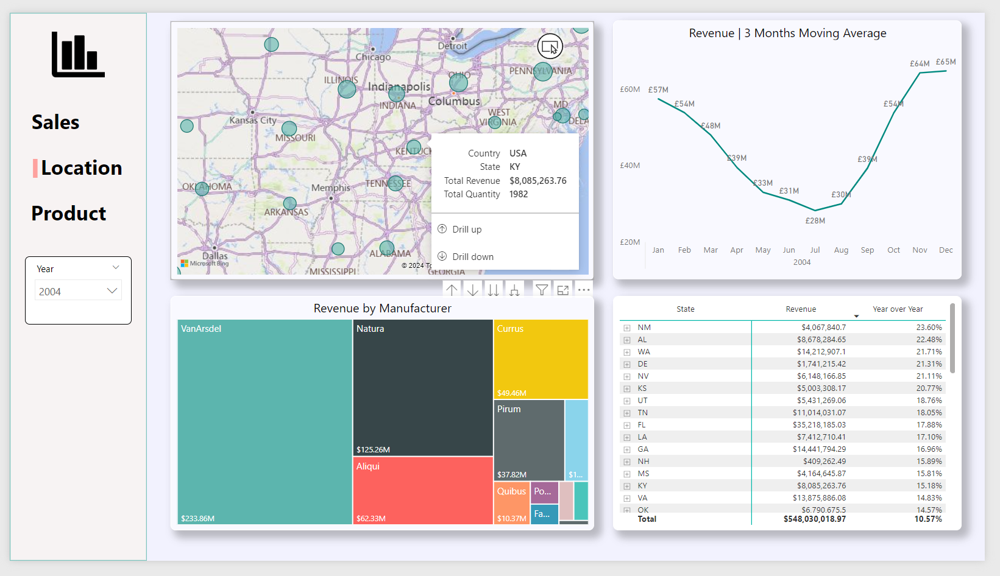
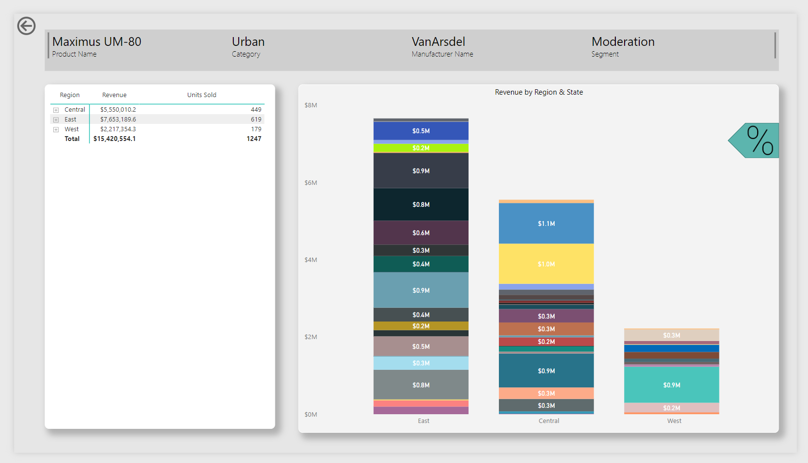

# Power BI Sales Report

The project includes:
- star schema,
- dynamic navigation,
- drillthrough,
- bookmarks,
- dynamic custom histogram,
- time-based aggregations,
- custom KPI formatting,
- tooltips.

Additionally:
- formatted DAX measures,
- usage of variables,
- optimized DAX calculations,
- calculation groups created with Tabular Editor.